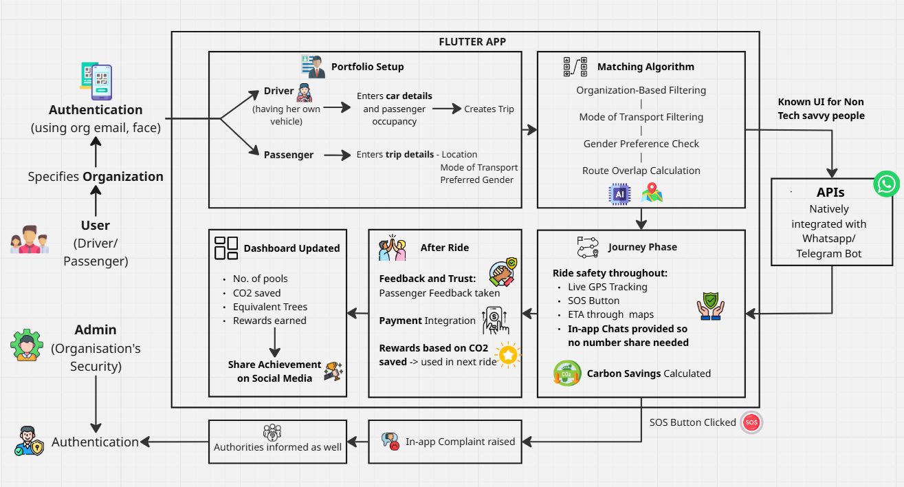

# 🌱 EcoPool - Sustainable Organization Car Pooling Platform

[](https://flutter.dev)
[](LICENSE)
[]()

> **Reducing carbon emissions, one shared ride at a time.**

A Flutter-based mobile application designed to promote sustainability by reducing carbon emissions through organization-based car pooling. Built with safety, trust, and environmental impact tracking at its core.

---

## 👥 Team Information

**Team Name:** Kapow

**Domain:** Sustainability

**Team Members:**
- Veda Patki
- Soham Patil

---

## 📋 Table of Contents

- [Problem Statement](#-problem-statement)
- [Key Features](#-key-features)
- [Tech Stack](#-tech-stack)
- [Architecture](#-architecture)
- [User Roles](#-user-roles)
- [Core Modules](#-core-modules)
- [Setup & Installation](#-setup--installation)
- [API Documentation](#-api-documentation)
- [Sustainability Metrics](#-sustainability-metrics)
- [Security & Safety](#-security--safety)
- [Contributing](#-contributing)
- [Roadmap](#-roadmap)

---

## 🎯 Problem Statement

Transportation is one of the largest contributors to carbon emissions globally. Single-occupancy vehicles contribute significantly to:
- **High CO₂ emissions** per capita
- Traffic congestion in urban areas
- Increased fuel consumption
- Poor air quality

**Our Solution:** A secure, organization-based car pooling platform that incentivizes shared rides through rewards, ensures rider safety with built-in security features, and tracks real environmental impact.

---

## ✨ Key Features

### 🔐 Authentication & Security
- **Multi-factor Authentication**
  - Organization email verification
  - Face authentication (biometric)
  - Role-based access control (Driver/Passenger/Admin)

### 🚗 Smart Ride Matching
- **Intelligent Algorithm** that considers:
  - Organization affiliation
  - Route overlap using Maps API
  - Gender preferences
  - Mode of transport
  - Real-time availability

### 🌍 Sustainability Tracking
- **Real-time Dashboard** displaying:
  - Total pooled rides
  - CO₂ emissions saved (kg)
  - Equivalent trees planted
  - Personal carbon footprint reduction
  - Rewards earned

### 🛡️ Safety Features
- **Live GPS tracking** throughout journey
- **SOS button** with instant alert to organization authorities
- **In-app chat** (no phone number sharing)
- **ETA calculation** and route monitoring
- **Trust scoring** for drivers and passengers

### 💰 Rewards System
- Earn rewards based on CO₂ saved per ride
- Redeem rewards on future rides
- Gamification to encourage consistent pooling

### 📱 Social Integration
- Share achievements on social media
- WhatsApp bot integration for ride notifications
- Telegram bot support
- In-app messaging for coordination

### ⭐ Trust & Feedback
- Post-ride feedback system
- Driver and passenger ratings
- Complaint mechanism with admin escalation
- Transparent trust scores

---

## 🛠️ Tech Stack

### Frontend
- **Framework:** Flutter 3.0+
- **State Management:** Provider / Riverpod / Bloc
- **Maps:** Google Maps API / Mapbox
- **Authentication:** Firebase Auth + Face Recognition SDK
- **Real-time:** Firebase Realtime Database / WebSockets

### Backend
- **API:** Node.js (Express) / Python (FastAPI) / Firebase Functions
- **Database:** PostgreSQL / MongoDB
- **Real-time:** Socket.io / Firebase
- **Payment:** Razorpay / Stripe
- **Cloud:** AWS / Google Cloud Platform / Firebase

### AI/ML
- **Route Matching:** Custom algorithm using Haversine formula
- **Carbon Calculation:** EPA emission factors
- **Face Recognition:** ML Kit / AWS Rekognition

### Third-party Integrations
- Google Maps API (routing, geocoding)
- WhatsApp Business API
- Telegram Bot API
- Payment Gateway SDK

---

## 🏗️ Architecture

### System Architecture

Our carpooling platform follows a comprehensive architecture designed for safety, sustainability, and seamless user experience:



#### Key Components:

1. **Authentication Layer**
   - Organization-based email verification
   - Face recognition for enhanced security
   - Role-based access (Driver/Passenger/Admin)

2. **Portfolio Setup**
   - **Driver**: Enters car details and passenger occupancy
   - **Passenger**: Enters trip details (location, mode of transport, preferred gender)

3. **Matching Algorithm**
   - Organization-based filtering
   - Mode of transport filtering
   - Gender preference check
   - Route overlap calculation using Maps API
   - AI-powered intelligent matching

4. **Journey Phase**
   - Live GPS tracking throughout the ride
   - SOS button for emergencies
   - ETA calculation through maps integration
   - In-app chats (no phone number sharing needed)
   - Real-time carbon savings calculation

5. **After Ride**
   - Feedback and trust scoring system
   - Payment integration for seamless transactions
   - CO₂-based rewards system
   - Social media sharing of achievements

6. **Dashboard Updates**
   - Number of pools completed
   - Total CO₂ saved
   - Equivalent trees planted metric
   - Rewards earned and tracking

7. **Safety & Compliance**
   - SOS alerts to organization authorities
   - In-app complaint system
   - Authentication verification at each stage

8. **API Integration**
   - Native integration with WhatsApp/Telegram bots for non-tech-savvy users
   - Push notifications for ride updates
   - Real-time messaging capabilities

---

## 👥 User Roles

### 1️⃣ **Driver**
- Create trip listings
- Specify vehicle details and occupancy
- Set gender preferences
- Accept/reject ride requests
- Track sustainability impact
- Earn rewards

### 2️⃣ **Passenger**
- Search and book available rides
- View matched trips based on route
- Real-time ride tracking
- In-app payment
- Rate drivers post-ride

### 3️⃣ **Admin (Organization Security)**
- Monitor all rides within organization
- Receive SOS alerts with live location
- Handle complaints and disputes
- Access trust scores and feedback
- View organization-wide sustainability metrics

---

## 🧩 Core Modules

### Module 1: Authentication & Onboarding
**Features:**
- Organization email verification
- Face authentication setup
- Role selection (Driver/Passenger)
- Profile creation with preferences
- Vehicle registration (for drivers)

**Screens:**
- `LoginScreen`
- `FaceAuthSetupScreen`
- `RoleSelectionScreen`
- `ProfileSetupScreen`
- `VehicleRegistrationScreen`

---

### Module 2: Trip Creation & Management
**Features:**
- Enter start/end locations
- Set departure time
- Specify passenger capacity
- Gender preference selection
- Trip publishing

**Screens:**
- `CreateTripScreen`
- `MyTripsScreen`
- `TripDetailsScreen`

---

### Module 3: Smart Matching Engine
**Algorithm Logic:**
```
1. Filter by organization
2. Filter by mode of transport
3. Validate gender preferences
4. Calculate route overlap (>70% match threshold)
5. Check availability and timing
6. Rank matches by proximity and ratings
```

**Screens:**
- `SearchRidesScreen`
- `MatchedRidesListScreen`
- `RideDetailsScreen`

---

### Module 4: Live Ride Experience
**Features:**
- GPS tracking in real-time
- ETA updates
- In-app chat
- SOS button (visible throughout)
- Route deviation alerts

**Screens:**
- `LiveRideScreen`
- `ChatScreen`
- `SOSScreen`

---

### Module 5: Dashboard & Sustainability
**Metrics Displayed:**
- Total rides completed
- CO₂ saved (calculated using formula)
- Tree equivalent: `CO₂ saved / 21.77 kg per tree/year`
- Rewards balance
- Personal contribution ranking

**Screens:**
- `DashboardScreen`
- `SustainabilityStatsScreen`
- `LeaderboardScreen`

---

### Module 6: Payment & Rewards
**Features:**
- In-app payment integration
- Automatic fare calculation based on distance
- Reward points credited post-ride
- Redemption system

**Screens:**
- `PaymentScreen`
- `RewardsScreen`
- `TransactionHistoryScreen`

---

### Module 7: Feedback & Trust System
**Features:**
- Post-ride rating (1-5 stars)
- Written feedback option
- Trust score calculation
- Complaint filing with admin escalation

**Screens:**
- `FeedbackScreen`
- `ComplaintScreen`
- `TrustScoreScreen`

---

### Module 8: Social & Bot Integration
**Features:**
- Share CO₂ savings on Instagram/Twitter/LinkedIn
- WhatsApp notifications for ride updates
- Telegram bot for quick ride searches

**APIs:**
- WhatsApp Business API
- Telegram Bot API
- Social media sharing SDKs

---

## 🚀 Setup & Installation

### Prerequisites
```bash
- Flutter SDK (3.0+)
- Dart SDK
- Android Studio / Xcode
- Firebase account
- Google Maps API key
- Node.js (for backend)
```

### Installation Steps

1. **Clone the repository**
```bash
git clone https://github.com/vedaXD/Arcane-Hackathon.git
cd Arcane-Hackathon
```

2. **Install Flutter dependencies**
```bash
flutter pub get
```

3. **Configure Firebase**
- Add `google-services.json` (Android) to `android/app/`
- Add `GoogleService-Info.plist` (iOS) to `ios/Runner/`

4. **Add API Keys**
Create `.env` file:
```env
GOOGLE_MAPS_API_KEY=your_key_here
PAYMENT_GATEWAY_KEY=your_key_here
WHATSAPP_API_KEY=your_key_here
TELEGRAM_BOT_TOKEN=your_token_here
```

5. **Run the app**
```bash
flutter run
```

---

## 📡 API Documentation

### Base URL
```
https://api.ecopool.com/v1
```

### Endpoints

#### Authentication
```http
POST /auth/register
POST /auth/login
POST /auth/verify-face
POST /auth/logout
```

#### Trips
```http
POST /trips/create
GET /trips/search?location={lat,lng}&radius={km}
GET /trips/{id}
PUT /trips/{id}/cancel
```

#### Matching
```http
POST /matching/find-rides
GET /matching/suggestions
```

#### Rides
```http
POST /rides/book
GET /rides/{id}/track
POST /rides/{id}/sos
PUT /rides/{id}/complete
```

#### Payments
```http
POST /payments/initiate
POST /payments/verify
GET /payments/history
```

#### Feedback
```http
POST /feedback/submit
GET /feedback/{userId}
POST /complaints/create
```

---

## 🌱 Sustainability Metrics

### Carbon Emission Calculation

**Formula:**
```
CO₂ saved = (Distance in km) × (Emission factor) × (Passengers pooled)

Where:
- Petrol car: 0.192 kg CO₂/km
- Diesel car: 0.171 kg CO₂/km
- Electric car: 0.053 kg CO₂/km
```

**Example:**
```
20 km trip with 3 passengers in a petrol car:
CO₂ saved = 20 × 0.192 × 3 = 11.52 kg CO₂
Trees equivalent = 11.52 / 21.77 = 0.53 trees
```

### Tree Equivalence
- **1 tree absorbs ~21.77 kg CO₂ per year**
- Display converted to "days of tree growth"

---

## 🛡️ Security & Safety

### Safety Measures
1. **SOS System**
   - One-tap emergency alert
   - Live location shared with admin
   - Auto-dial emergency contact

2. **Identity Verification**
   - Organization email mandatory
   - Face authentication
   - Government ID verification (optional)

3. **Privacy Protection**
   - Phone numbers never shared
   - In-app chat only
   - Location shared only during active ride

4. **Trust System**
   - Minimum trust score required to ride
   - Automatic suspension on multiple complaints
   - Admin review process

---

## 🤝 Contributing

We welcome contributions! Please follow these steps:

1. Fork the repository
2. Create a feature branch (`git checkout -b feature/AmazingFeature`)
3. Commit changes (`git commit -m 'Add AmazingFeature'`)
4. Push to branch (`git push origin feature/AmazingFeature`)
5. Open a Pull Request

### Coding Standards
- Follow Flutter/Dart style guide
- Write unit tests for new features
- Update documentation
- Ensure all tests pass

---

## 🗺️ Roadmap

### Phase 1 (MVP) ✅
- [x] Authentication system
- [x] Basic ride creation and matching
- [x] Live tracking
- [x] Payment integration

### Phase 2 (Current)
- [ ] Advanced matching algorithm
- [ ] Rewards system
- [ ] SOS feature
- [ ] Admin dashboard

### Phase 3 (Future)
- [ ] WhatsApp/Telegram bot integration
- [ ] Social media sharing
- [ ] Multi-language support
- [ ] AI-powered route optimization
- [ ] Corporate partnerships
- [ ] Carbon credit marketplace

---

## 📊 Impact Goals

**By 2027:**
- 🚗 1 million+ pooled rides
- 🌍 500,000 kg CO₂ emissions reduced
- 🌳 23,000 trees equivalent planted
- 👥 50,000+ active users
- 🏢 100+ partner organizations

---

## 📄 License

This project is licensed under the MIT License - see the [LICENSE](LICENSE) file for details.

---

## 👏 Acknowledgments

- **EPA** for emission factor data
- **Google Maps Platform** for routing APIs
- **Flutter Community** for amazing packages
- All contributors and testers

---

## 📞 Contact & Support

- **Team:** Arcane Hackathon Team
- **GitHub:** [@vedaXD](https://github.com/vedaXD)
- **Project Link:** [https://github.com/vedaXD/Arcane-Hackathon](https://github.com/vedaXD/Arcane-Hackathon)

---

<div align="center">

**Made with 💚 for a sustainable future**

*Every ride shared is a step towards cleaner air and a healthier planet.*

</div>